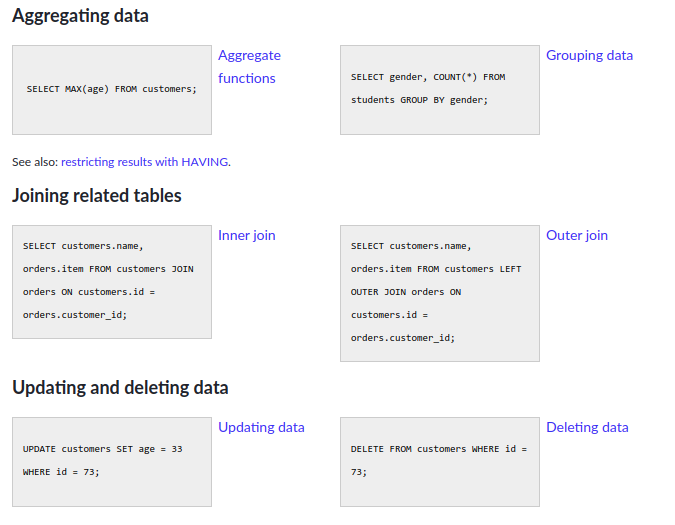

# SQL-Web Scraping Toolbox

## Introduction

SQL stands for Structured Query Language and is used to handle data in relational databases. The data in relational databases is organized in tables with specified relations between the values and entries. In this toolbox you will use SQL commands and PySqlite, a python interface for SQLite, to save information that you scrape from a website into a database.

## Get set

-> github classroom invite link here

Before getting started, make sure you have the following installed

`pip install beautifulsoup4`

`pip install requests`


## Web Scraping with Beautiful Soup

Beautiful Soup is a python library that helps with scraping html files making it very useful in the context of web scraping. There are many areas of study where web scraping will become a handy tool to have in your back pocket.

In order to use Beautiful Soup, it helps to have a general understanding of HTML and how it is structured. You will be working with Beautiful Soup objects which are nested structures that are intuitive if you are familiar with HTML structure.

> Check out [this short article](https://towardsdatascience.com/ethics-in-web-scraping-b96b18136f01) about the ethics and responsibilities of web scraping!

### Create the Soup!

Create a Beautiful Soup object by passing in an HTML file or by using a url and the requests library.

```python
from bs4 import BeautifulSoup
import requests

# HTML file
soup = BeautifulSoup(html_doc, 'html.parser')

# URL
html = requests.get(<url>)
soup = BeautifulSoup(html.text, "html.parser")
```

Now that you have the Soup object, you can extract the information in all different kinds of ways. Here is an example from the Beautiful Soup documentation of ways you can navigate the data. In general, you can filter the information by searching for specific tags, class names, id etc. or by using relative relationships like parents, siblings, children etc. Check out the [official documentation](https://www.crummy.com/software/BeautifulSoup/bs4/doc/) to get a broader sense of how you can interact with Beautiful Soup objects.

```python
soup.title
# <title>The Dormouse's story</title>

soup.title.string
# u'The Dormouse's story'

soup.p
# <p class="title"><b>The Dormouse's story</b></p>

soup.p['class']
# u'title'

soup.a
# <a class="sister" href="http://example.com/elsie" id="link1">Elsie</a>

soup.find_all('a')
# [<a class="sister" href="http://example.com/elsie" id="link1">Elsie</a>,
#  <a class="sister" href="http://example.com/lacie" id="link2">Lacie</a>,
#  <a class="sister" href="http://example.com/tillie" id="link3">Tillie</a>]

soup.find(id="link3")
# <a class="sister" href="http://example.com/tillie" id="link3">Tillie</a>
```

### Your task (part 1)

Using the Beautiful Soup library, you are going to do some web scraping of your own! Web scraping can be a tricky task, especially if it is your first time. Here are a couple of websites that are good for practicing web scraping techniques, or you can choose your own website to scrape.

[Book Catalog](http://books.toscrape.com/) - scrape book product listings

[Quotes](http://quotes.toscrape.com/) - scrape quotes


## SQL and Databases

Databases help developers manage and store information in an organized way so that retrieving, manipulating, and protecting the data is done in a more efficient way. There are a handful of different types of databases, each that have their own strengths and weaknesses. This toolbox is just going to cover relational databases, but looking onto other types of databases is something you can definitely explore in the going farther section!

[Relational databases](https://dev.to/lmolivera/everything-you-need-to-know-about-relational-databases-3ejl) store data in a structured manner. There are predefined relationships between the different entries and every entry is stored in the same fashion. When you have a lot of data of the same type, organizing it in structured database can be very advantageous.

### Vocabulary

Databases in this context have a few specific keywords that are good to familiarize yourself with if you aren't already.

**&nbsp;&nbsp;&nbsp;&nbsp; Table:** a set of data elements

**&nbsp;&nbsp;&nbsp;&nbsp; Record (row):** each piece of data entered in the table

**&nbsp;&nbsp;&nbsp;&nbsp; Field (column):** the different components of a record

**&nbsp;&nbsp;&nbsp;&nbsp; Primary Key:** a field that contains unique values and can be used to identify each record


### Creating and connecting to a database

Import Sqlite3 at the top of your file and connect to the database. If the .db file doesn't exist, it will create one for you and connect, otherwise it will create the connection object for the existing one. After connecting, you need to establish a `cursor()` object which allows you to traverse the database and is needed to execute SQL commands.

```python
import sqlite3
connection = sqlite3.connect("example.db")
c = connection.cursor()

# when you are done, you can close the conection
conn.close()
```

Once you have established your connection and cursor, you can can execute SQL commands and commit the changes to the database using the following lines:

```python
c.execute("""<SQL command>""")
conn.commit()
```

The SQL commands, for example `CREATE TABLE`, `SELECT`, and `INSERT INTO`, are passed to the `execute()` method.


#### Creating a Table

Here is an example of an SQL command that will create a table named **fruits** where each entry has an id, name, description, and price. Each value also has a type that in associated with it. Check out [this list](https://www.w3schools.com/sql/sql_datatypes.asp) for more data types in SQL.

```sql
CREATE TABLE IF NOT EXISTS fruits (
	id INTEGER PRIMARY KEY,
	name TEXT,
	description TEXT,
	price INTEGER
);
```

Python execution

```python
create_table_command = """CREATE TABLE IF NOT EXISTS fruits (
						  id INTEGER PRIMARY KEY,
						  name TEXT,
						  description TEXT,
						  price INTEGER
						  ); """
c.execute(create_table_command)
conn.commit()
```

> Tips:
>
> - Since you will be using commands multiple times but with different values, you can use variables and [string formatting](https://realpython.com/python-f-strings/#f-strings-a-new-and-improved-way-to-format-strings-in-python) to build the commands.
> -  For more SQL commands, [w3schools](https://www.w3schools.com/sql/default.asp) has many helpful examples that show the different functionalities SQL is capable of.
> - Basic SQL commands from Khan Academy intro course that are listed [down below](#Basic-SQL-Commands)
>
>


### Your task (part 2)

Create a database using the PySqlite library and store data that you get from scraping websites with the Beautiful Soup library. Make sure to add a function that prints all of the data in your table or use the [CLI](Command-Line-Interface) to display the entries and include a screen shot in your repo!


## What to turn in

Push the your web scraping and database work to GitHub.


## Helpful Resources (also mentioned throughout instructions)

[sqlite3 (python) Official Documentation](https://docs.python.org/2/library/sqlite3.html)

[BeautifulSoup Official Documentation](https://www.crummy.com/software/BeautifulSoup/bs4/doc/)

[Web Scraping Introduction/Overview](https://medium.com/velotio-perspectives/web-scraping-introduction-best-practices-caveats-9cbf4acc8d0f)

[SQL commands with examples](https://www.w3schools.com/sql/default.asp)

[Relational Databases](https://dev.to/lmolivera/everything-you-need-to-know-about-relational-databases-3ejl)


## Basic SQL Commands

> From the Khan Academy[ Intro to SQL](https://www.khanacademy.org/computing/computer-programming/sql#sql-basics) course





#### Command Line Interface

You can also use the command line interface by typing in `sqlite3` in the terminal. The [CLI documentation](https://sqlite.org/cli.html) is a helpful resource if you want to explore this tool. It can be helpful to use this interface to see if your data has been added to your database properly. You can also execute SQL commands from this interface.

```pseudocode
$ sqlite3
SQLite version 3.11.0 2016-02-15 17:29:24
Enter ".help" for usage hints.
sqlite> .open example.db
sqlite>
```


